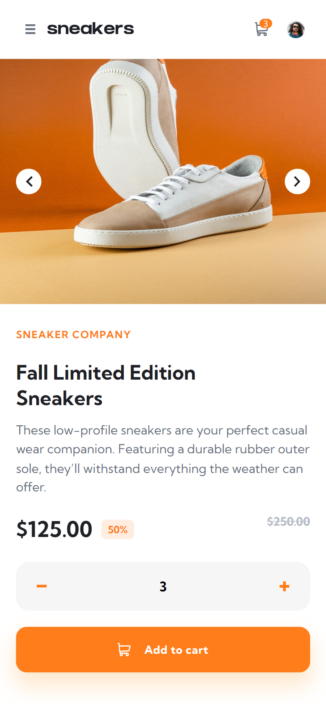

# E-commerce product page solution

This is a solution to the [E-commerce product page challenge on Frontend Mentor](https://www.frontendmentor.io/challenges/ecommerce-product-page-UPsZ9MJp6). Frontend Mentor challenges help you improve your coding skills by building realistic projects.

## Table of contents

- [Overview](#overview)
  - [The challenge](#the-challenge)
  - [Screenshot](#screenshot)
  - [Links](#links)
- [My process](#my-process)
  - [Built with](#built-with)
  - [What I learned](#what-i-learned)
- [Installation](#installation)
- [Author](#author)

## Overview

### The challenge

Users should be able to:

- View the optimal layout for the site depending on their device's screen size
- See hover states for all interactive elements on the page
- Open a lightbox gallery by clicking on the large product image
- Switch the large product image by clicking on the small thumbnail images
- Add items to the cart
- View the cart and remove items from it

### Screenshot




### Links

[Live demo](https://chris-ai.github.io/ecommerce-product-page/)

## My process

### Built with

- HTML5
- SCSS
- CSS pseudo elements (::after, ::before)
- Flexbox
- CSS Grid
- Mobile-first workflow
- Responsive Web Design
- Re-usable components
- [Vue.js](https://vuejs.org/) - JS library

### What I learned

The dask provided a training groud for the Vue.js framework. I tried to build as many re-usable components as possible. There was a good space to test my SCSS skills, this was not first time I've touched this CSS preprocessor but I'm not quite confident with it. I've used many of pseudo elements and I think that's work out.

## Installation

```
npm install
```

### Compiles and hot-reloads for development

```
npm run serve
```

### Compiles and minifies for production

```
npm run build
```

### Lints and fixes files

```
npm run lint
```

## Author

- LinkedIn - [Krzysiek Kondracikowski](https://www.linkedin.com/in/krzysztof-kondracikowski-87a3491b3/)
- Frontend Mentor - [@Chris-ai](https://www.frontendmentor.io/profile/Chris-ai)
- Twitter - [@kondr7_krzysiek](https://twitter.com/kondr7_krzysiek)
